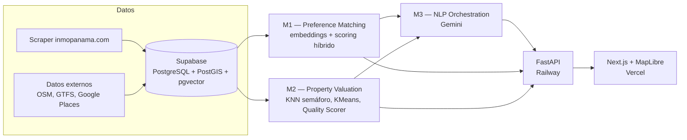

# Real Estate Intelligence Platform (REIP)

Plataforma de recomendación inmobiliaria para Panamá — scoring de zona, semáforo de precios y
búsqueda en lenguaje natural. FastAPI · Next.js · Supabase.

Proyecto semestral, Universidad Tecnológica de Panamá — Curso 0698.

## Estado del proyecto

Proyecto entregado y calificado en julio de 2026. La plataforma en vivo (Railway/Supabase/Vercel)
está actualmente pausada. El código queda disponible para revisión y para correr localmente —
instrucciones abajo.

## Arquitectura

Cadena de dependencia dura entre módulos: el pipeline de datos alimenta M1 y M2, y M3 los orquesta
a ambos vía Gemini — M3 nunca escanea los listings directamente.



## Módulos

- **M1 — Preference Matching:** matching lifestyle-propiedad. Scoring híbrido 0.6 estructurado /
  0.4 semántico, embeddings con `gemini-embedding-001` (3072 dimensiones).
- **M2 — Property Valuation:** evaluación multidimensional de propiedades.
  - Semáforo de precio (KNN, modelo de producción). MAE en test: $187,543 (33.4% del precio
    promedio).
  - Random Forest como comparación metodológica, no reemplaza al semáforo. MAE en test: $149,270
    (26.6%).
  - Segmentación de mercado (KMeans, k=2, Silhouette=0.388): segmento compacto/económico (662
    propiedades, mediana $270K / 92m²) y segmento grande/premium (380 propiedades, mediana $736K /
    300m²).
  - Quality Scorer (LLM sobre el texto de la descripción del listing).
- **M3 — NLP Orchestration:** orquesta M1 y M2 vía Gemini a partir de una consulta en lenguaje
  natural. Umbral de confianza de extracción de intención: 0.65.

## Stack

- **DB:** Supabase (PostgreSQL + PostGIS + pgvector)
- **Backend:** FastAPI, deploy en Railway
- **Frontend:** Next.js 14 + MapLibre GL JS, deploy en Vercel
- **Pipeline:** Python (scraping, normalización de datos externos, entrenamiento de modelos)

## Setup local

Requiere una instancia de Supabase con el schema aplicado (`supabase/migrations/`) y las variables
de entorno configuradas (ver abajo).

```bash
# Backend
cd backend
python -m venv venv && source venv/bin/activate
pip install -r requirements.txt
uvicorn app.main:app --reload

# Frontend (en otra terminal)
cd frontend
npm install
npm run dev
```

## Variables de entorno

El archivo `.env` real vive en la raíz del repo (no en `backend/`) — el backend lo localiza con
`find_dotenv()`, que busca hacia arriba desde el directorio de ejecución. Nombres de variable en
[`backend/.env.example`](backend/.env.example).
